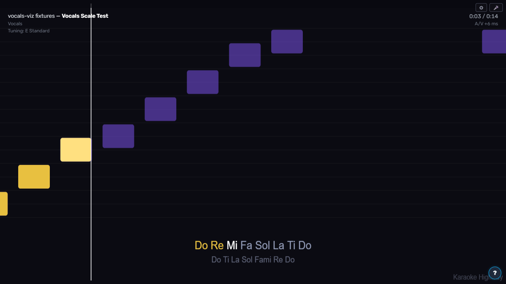

# Karaoke Highway

A [FeedBack](https://github.com/got-feedback/feedBack) visualization plugin that makes
**vocals a first-class instrument**: a SingStar-style pitch-ribbon highway that
auto-selects when a song's active arrangement is Vocals, with live microphone pitch
detection and per-syllable scoring.



## Features

- **Pitch ribbon highway** — one bar per syllable, positioned by pitch, sweeping past
  a fixed playhead; the song's vocal range sets the vertical scale automatically.
- **Auto-selection** — with the visualization picker on *Auto*, vocals arrangements
  get the ribbon without any clicking; guitar/keys/drum songs keep their own highways.
- **Live mic scoring** — YIN pitch detection on your microphone, a live pitch marker
  at the playhead, per-syllable accuracy tint (red→green) on the bars, and a running
  session accuracy pill. Press `m` in the player to toggle the mic.
- **Karaoke lyrics** — words assemble into readable lines (sung/active/upcoming
  coloring, next-line preview) rather than colliding under their bars on fast songs.
- **End-of-song summary** — overall accuracy, syllables hit, and best streak.
- **Mic settings** (gear button on the highway) — input device picker (independent of
  your instrument input), capture channel select for multi-input interfaces, pitch
  tolerance, and octave-free matching for singing in whatever octave fits your voice.
- **Splitscreen ready** — each panel gets its own renderer; mic scoring follows the
  vocals panel, so a guitarist and a singer can share one screen.

## Requirements

- FeedBack **0.3.0-alpha.1** or later.
- Song content: a feedpak whose Vocals arrangement carries `notation`, plus `lyrics`
  and `vocal_pitch` side-files
  ([feedpak-spec](https://github.com/got-feedback/feedpak-spec) v1.14, §7.1/§7.2).
- A microphone. Any input the browser can see works; latency is compensated, so an
  audio-interface channel or a plain USB mic are both fine.

## Install

**From a release:** download the plugin zip from the releases page and extract the
`feedback-vocals-viz` folder into your FeedBack user-plugins directory (or install the
zip through the in-app plugin manager). Restart FeedBack.

**From source:** copy (or junction/symlink) this repository into the user-plugins
directory and restart FeedBack.

Open a song with a Vocals arrangement — with the picker on *Auto* the ribbon selects
itself; otherwise pick **Karaoke Highway** manually. Click 🎤 on the highway to start
mic scoring (your browser/app will ask for microphone permission once).

## Settings

Everything lives in the gear popover next to the mic button, persisted in
`localStorage` under `vocals_highway.*` keys: mic device, capture channel
(mix / channel 1 / channel 2), match tolerance in semitones, and octave-free scoring.
The same settings are exposed to splitscreen's per-panel controls via FeedBack's
visualization settings contract.

## Development

```
pip install pytest pyyaml jsonschema
pytest tests/ -v          # content-free: fixtures are synthesized on the fly
node --check screen.js    # renderer syntax gate (same as CI)
python tools/build_test_pak.py --validate   # build + spec-validate (needs a feedpak-spec checkout)
```

The test paks (a solfège scale with vocals+guitar arrangements, and a 4-instrument
"band" variant) are generated from code — no copyrighted song content exists in or
ships with this repository. The `--validate` step and the spec-validation test need a
[feedpak-spec](https://github.com/got-feedback/feedpak-spec) checkout: by default they
look for one as a sibling directory (`../feedpak-spec`), or set `FEEDPAK_SPEC_DIR` to
point elsewhere. CI pins `v1.14.0`.

See [CLAUDE.md](CLAUDE.md) for an architecture map and contributor/agent notes.

## AI disclosure, warranty, and contributions

**This plugin was built with heavy use of AI coding tools.** The large majority of
the code was written by an AI assistant working under human direction, with human
review and hands-on testing against a real FeedBack install — but you should read it
with the same skepticism you'd apply to any code of unknown provenance.

**There is no warranty.** This is open-source software provided **as-is**, without
warranty of any kind, express or implied — see sections 15 and 16 of the
[LICENSE](LICENSE). It pokes at live audio devices and renders inside another
application; if it breaks something, you get to keep both pieces.

**Contributions are welcome.** If you find a bug or want a feature, open an issue —
or better, submit a pull request. Small, focused PRs with a description of what was
tested are the easiest to review. By contributing you agree your changes are licensed
under the same AGPL-3.0 terms.

## License

**AGPL-3.0** — see [LICENSE](LICENSE). The microphone/YIN/ribbon engine is adapted
from the AGPL-3.0
[feedBack-plugin-lyrics-karaoke](https://github.com/got-feedback/feedBack-plugin-lyrics-karaoke)
plugin, which makes this a derivative work; provenance comments mark the adapted code
in [screen.js](screen.js) and [routes.py](routes.py).
